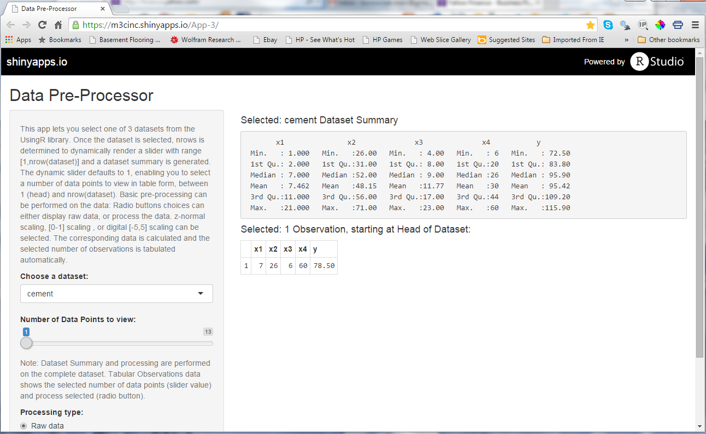
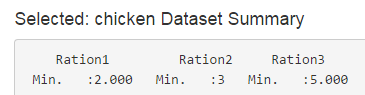
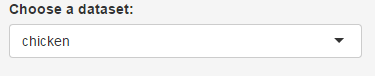
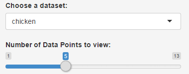
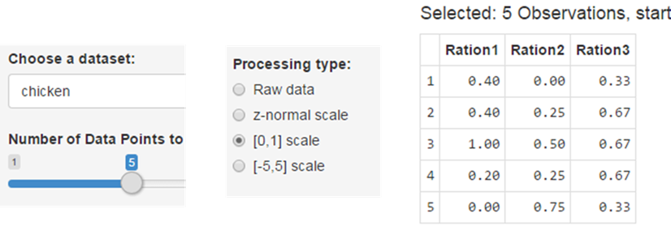

Data Pre-Processor
========================================================
author: Marc Borowczak
font-family: cursive
date: 2015-06-06
css: custom.css
transition: rotate
class: footer

[](mailto:borowczak.marc@gmail.com)
***
[](https://m3cinc.shinyapps.io/App-3/)

Functionality   
========================================================
class: small-code
class: center

You Select:  
A dataset from the UsingR library (cement,chips,chicken)    
Number of points to view [1,nrow(dataset)]... yes it's dynamic!    
A process view (raw, z-norm, [0-1] or [-5,5] scaled data)    

[Dynamic App](https://m3cinc.shinyapps.io/App-3/):
renders selection, displays summary, and view: <center></center>


```
    Ration1         Ration2     Ration3     
 Min.   :2.000   Min.   :3   Min.   :5.000  
 1st Qu.:3.000   1st Qu.:4   1st Qu.:6.000  
 Median :4.000   Median :5   Median :6.000  
 Mean   :4.154   Mean   :5   Mean   :6.385  
 3rd Qu.:5.000   3rd Qu.:6   3rd Qu.:7.000  
 Max.   :7.000   Max.   :7   Max.   :8.000  
```

Dataset Summary Header Rendering
========================================================
class: small-code
class: center

```
sidebarPanel(selectInput("dataset", label="Choose a dataset:",...))
```
<center></center>
RenderText() in server.R
```
output$outid1<-renderText({text<-paste("Selected:",input$dataset)
                           text<-paste(text," Dataset Summary")})
```
Display via textOutput()in ui.R mainPanel()
```
mainPanel(h4(textOutput("outid1")),...)
```
<center></center>

Dynamic Slider Rendering & Display
========================================================
class: small-code
class: center

RenderUI() in server.R 

```
output$slider<-renderUI({dataset<-datasetInput()
                         sliderInput("inslider","Number of Data Points to view:",min=1,max=nrow(dataset),step=1,round=TRUE,ticks=FALSE,value=1)})
```

Display via uiOutput("slider") in ui.R

```
sidebarPanel(helpText(""),
             selectInput("dataset",...),
             uiOutput("slider"), ...
            )
```
<center></center>

Dynamic Processing Implementation
========================================================
class: small-code
class: center

Process functions are defined in top section of server.R,

```r
raw<-function (x) {return(x)} 
normalize<-function (x) {return((x-min(x))/(max(x)-min(x)))}
digitalize<-function (x) {return((10*(x-min(x))/(max(x)-min(x)))-5)}  
```
Reactive to processInput(), datasetInput() and input$slider
```
viewTable<-reactive({dataset<-datasetInput()
                     process<-processInput()
                     dataset<-as.data.frame(lapply(dataset,process))
                     head(dataset, max(1,input$inslider))  })
```
<center></center>
